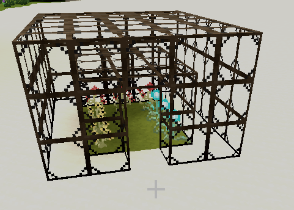
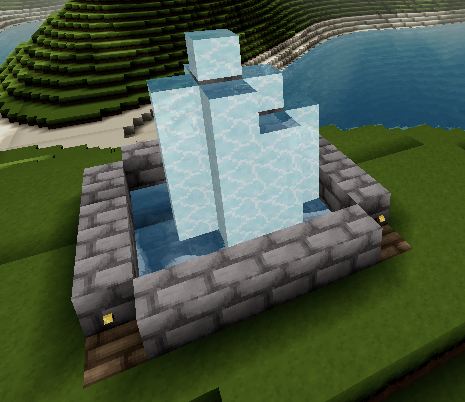

# Additional Structure Templates

This repository serves as a resting ground for all sorts of [Structure Templates](https://github.com/Terasology/StructureTemplates).
Have a new structure template?
Send it over here!

## How to add a new structure

To add a new structure `MyHouse` to this module follow these steps:

- place the structure template **prefab file** under [`assets/prefabs/structures/`](assets/prefabs/structures/), e.g., `assets/prefabs/structure/MyHouse.prefab`
- add a preview picture (a.k.a. a screenshot) in the `preview` directory, e.g., `preview/MyHouse.png` 
- add a section to the [README](README.md) file, e.g., 
    ```markdown
    ### My House
  
    
    ```
    
Finally, create a PR to submit your creation here.

## Available Structures

### Glass Storage Room


### Beach Chill Zone


### Mountain Entrance


### Well Entrance


### Yard


### Barn


### Greenhouse


### Watch Tower


### Cell Tower


### Moai Head


### Fountain


### Stage


### Waterpool


### Swimming Pool


### Fallout Shelter

